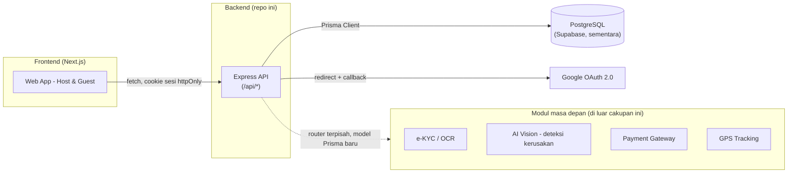
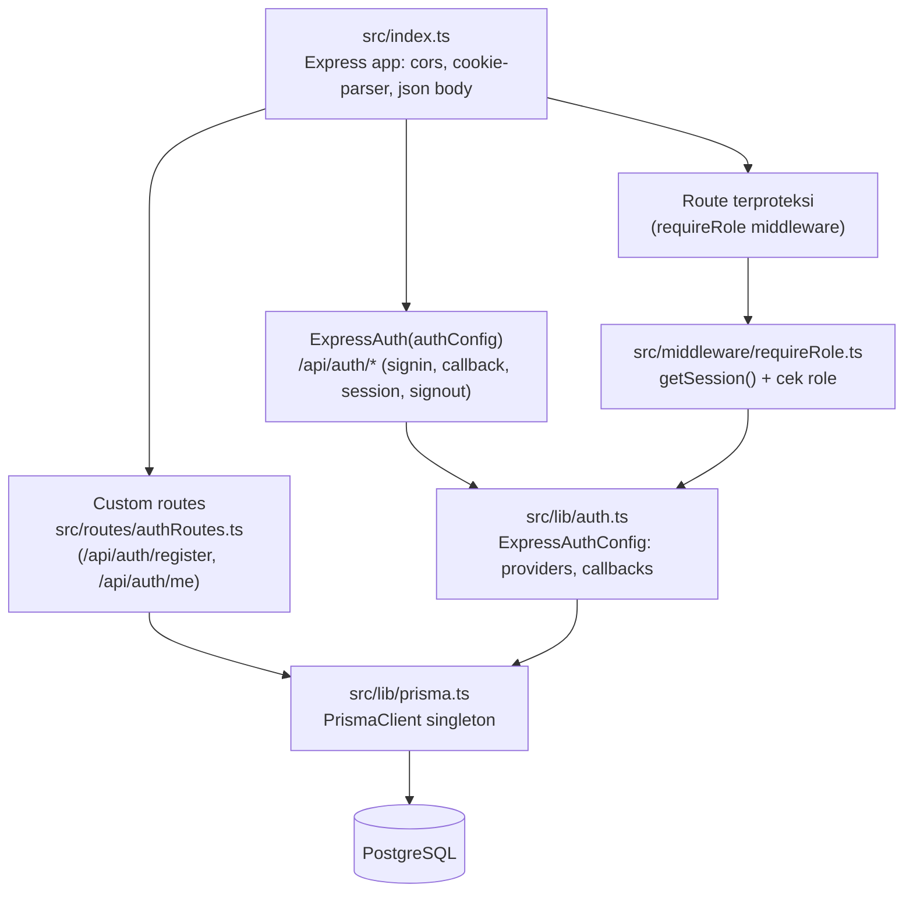
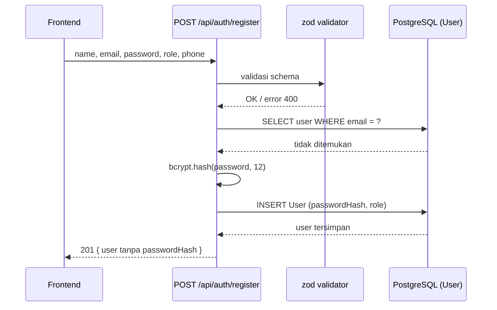
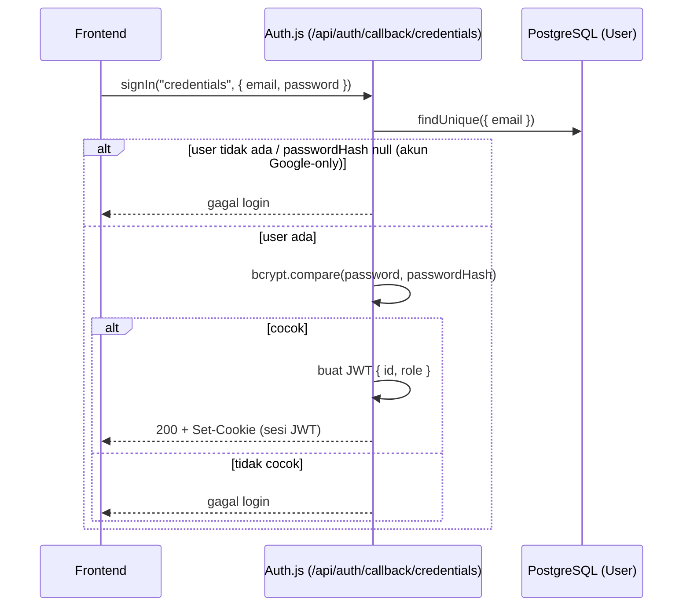
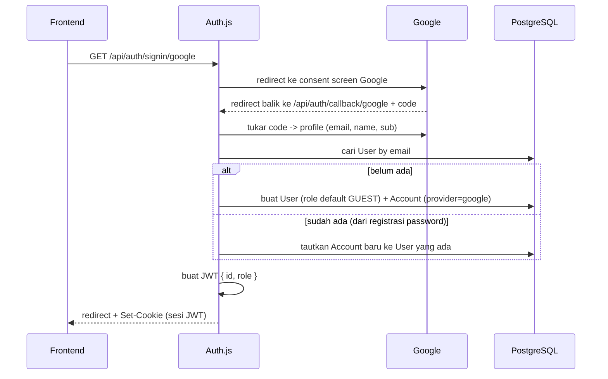
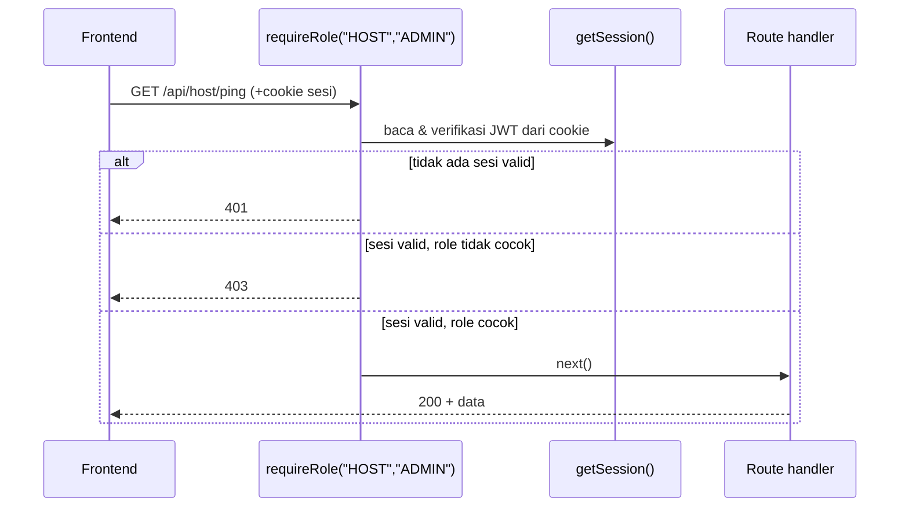

# ARSITEKTUR.md — Arsitektur Backend Rentify (Modul Autentikasi)

Dokumen ini menjelaskan **bagaimana** modul autentikasi dibangun secara
teknis: posisi backend dalam sistem Rentify secara umum, struktur lapisan
di dalam backend, alur request penting, serta rencana deployment. Untuk
**apa** yang harus dibangun (FR, kontrak API), lihat `be.md`.

## 1. Konteks sistem (di luar modul ini)

Rentify terdiri dari beberapa komponen; modul ini hanya membangun kotak
**Backend Auth** di bawah, tapi arsitekturnya dirancang supaya
modul-modul lain (booking, e-KYC, deteksi kerusakan, dsb.) tinggal
menambah router + model baru tanpa mengubah fondasi ini.

## 2. Lapisan di dalam backend

Urutan mounting di `index.ts` **penting dan tidak boleh dibalik**:
`authRoutes` (path spesifik: `/register`, `/me`) dipasang **sebelum**
wildcard `app.use("/api/auth/*", ExpressAuth(authConfig))`. Express
Router yang tidak menemukan route cocok otomatis `next()` ke middleware
berikutnya, jadi path lain di bawah `/api/auth/*` (signin, callback,
session, signout, csrf, providers) tetap jatuh ke Auth.js. Kalau urutan
dibalik, `ExpressAuth` akan mencoba menangani `/api/auth/register` sebagai
action Auth.js yang tidak dikenal dan gagal.

## 3. Alur request

### 3.1 Registrasi

### 3.2 Login email/password (Credentials)

### 3.3 Login Google (OAuth)

### 3.4 Akses route yang dibatasi peran

## 4. Arsitektur sesi & token

- **Strategi: JWT**, bukan database session. Ini bukan pilihan bebas —
  Auth.js tidak mendukung kombinasi Credentials provider + database
  session. Karena Credentials provider wajib ada (login email/password),
  seluruh sistem (termasuk login Google) memakai JWT supaya perilakunya
  konsisten untuk kedua provider.
- Token disimpan di **cookie httpOnly** yang diterbitkan Auth.js
  (bukan disimpan di localStorage sisi frontend), untuk mengurangi risiko
  XSS mencuri token.
- Model `Session` tetap ada di skema Prisma untuk kompatibilitas
  `@auth/prisma-adapter`, tapi **tidak dipakai** menyimpan baris sesi
  selama strategi JWT aktif — jangan bingung kalau tabel itu kosong.
- Payload token membawa `id` dan `role` (lewat callback `jwt`/`session`
  di `src/lib/auth.ts`), supaya middleware `requireRole` tidak perlu
  query database tambahan tiap request.

## 5. Keamanan

- Password di-hash `bcrypt` (cost 12), tidak pernah disimpan/di-log
  plain text.
- Secret (`AUTH_SECRET`, `AUTH_GOOGLE_SECRET`, `DATABASE_URL`) hanya di
  environment variable / secret manager (mis. Azure Key Vault atau
  GitHub Actions secrets untuk CI/CD) — tidak pernah di-commit.
- CORS dibatasi ke origin frontend yang dikenal (`CORS_ORIGIN`),
  `credentials: true` supaya cookie sesi ikut terkirim.
- Constraint unik di level database (`email`, `(provider,
  providerAccountId)`) sebagai lapisan pertahanan kedua di luar
  pengecekan aplikasi.
- Rencana lanjutan (belum diimplementasikan modul ini): rate limiting
  pada `/api/auth/register` dan endpoint login untuk mencegah brute
  force, serta verifikasi email (`emailVerified`) sebelum akses penuh.

## 6. Deployment & CI/CD

Mengikuti rancangan yang sudah disepakati tim di worksheet Week 2 (Lab
2.2 & 2.4):

- **Compute**: container/App Service di Azure menjalankan `npm run
  build && npm start` (Node.js, hasil kompilasi `dist/`).
- **Database**: **Supabase** (PostgreSQL managed) untuk sementara; rencana
  awal tim adalah Azure Database for PostgreSQL dan bisa kembali ke sana.
  Tetap bukan Postgres di dalam container yang sama dengan backend. Prisma
  memakai dua connection string: `DATABASE_URL` (pooled/pgbouncer, untuk
  aplikasi) dan `DIRECT_URL` (koneksi langsung, untuk `prisma migrate`).
- **CI/CD**: GitHub Actions (`main.yml`) menjalankan lint + build test
  Docker/Node setiap push/PR ke `main`, mencegah kode yang gagal build
  masuk ke branch utama. Tambahkan step `npm run build` (tsc) dan,
  setelah ada test suite, `npm test` ke workflow yang sama.
- **Environment terpisah**: minimal `development` (lokal, `.env`) dan
  `production` (Azure, env var lewat platform/secret manager). Redirect
  URI Google OAuth harus didaftarkan terpisah untuk tiap environment
  (`http://localhost:4000/api/auth/callback/google` vs domain produksi).

## 7. Keterluasan (extensibility) untuk modul berikutnya

Modul lain menambah, bukan mengubah, fondasi ini:

- Fitur baru = router baru di `src/routes/`, dipasang di `index.ts`
  sebelum wildcard Auth.js (ikuti pola §2).
- Data baru = model Prisma baru + migration baru; relasikan ke `User`
  lewat `userId` (pola yang sama seperti `Account`/`Session`).
- Butuh proteksi peran = pakai `requireRole(...)`/`requireAuth()` yang
  sudah ada, jangan menulis pengecekan sesi manual baru.
- Integrasi pihak ketiga (OCR e-KYC, AI vision, payment gateway) = service
  wrapper terpisah di `src/lib/`, dipanggil dari route terkait — tidak
  masuk ke `src/lib/auth.ts`.

## 8. Di luar cakupan dokumen ini

Arsitektur frontend (Next.js), arsitektur modul e-KYC/AI vision/payment/
GPS/chatbot secara rinci, dan arsitektur database untuk entitas non-auth
(Kendaraan, Booking, Transaksi, Rating) — didokumentasikan terpisah saat
modul-modul tersebut mulai dikerjakan.